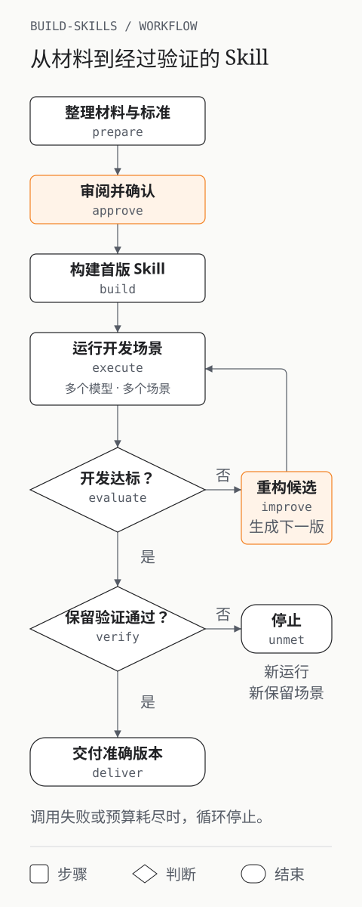

# build-skills

build-skills 是一个用于构建和验证 Agent Skill 的 Python CLI。它读取材料或已有 Skill，让配置的模型执行任务，根据失败证据改进候选版本。

你先审阅并确认目标、评估标准和场景。框架随后用同一候选 Skill 在多个模型上运行开发场景；达到标准后，再用未参与优化的保留场景验证。只有验证通过的版本才能交付。

## loop 如何运行

<p align="center">
  
</p>

## 开始使用

需要 Python 3.12、uv 和 macOS 或 Linux。

```bash
git clone https://github.com/wind8ai/build-skills.git
cd build-skills
uv sync --locked
uv run build-skills --help
uv run build-skills doctor --config examples/local-files/config.toml --json
uv run build-skills loop --config examples/local-files/config.toml --json
```

首次 loop 在确认点停止，返回运行标识、待审阅文档和摘要。按照 [本地示例](examples/local-files/README.md) 审阅并确认，再继续运行。

示例使用确定性进程替身，不调用真实模型。构建默认不限时，执行默认每个模型每次十五分钟，限制可在模板中调整。阶段采用文件交接，单个模型失败后继续其余模型，并支持只重试失败项。

Codex 和 Qoder 的实际完成度需用用户配置验证，框架测试不代替 Skill 质量验收。

## 继续运行与停止条件

`loop` 会根据已保存的状态继续执行。首次运行在准备完成后停止，等待你通过 `approve --accept DIGEST` 确认审阅的版本。

`build` 创建首版候选 Skill。开发评估未通过时，`improve` 根据失败证据生成并保存下一版候选，再由 `execute` 重新运行开发场景。循环中的改进已经包含候选 Skill 的重构，不会再次调用 `build`。

直接检查与匿名模型判断共同提供评估证据；开发场景通过后，框架才开始保留场景验证。保留验证失败时，当前运行停止，继续优化需要新运行和新的保留场景。

调用失败时，框架保存已有结果并停止自动循环。用 `execute --retry-failed` 或 `verify --retry-failed` 重试失败项，预算耗尽时也会停止。交付目录只包含通过验证的 Skill 及报告。实际使用中的问题可通过 `feedback --file PATH` 保存，供同一工作区下次准备时读取。

## 文档

- [产品意图](docs/intent.md)
- [框架设计](docs/design.md)
- [CLI 与配置](docs/cli.md)
- [开发约定](CONTRIBUTING.md)

## 许可证

本项目使用 [MIT 许可证](LICENSE)。
